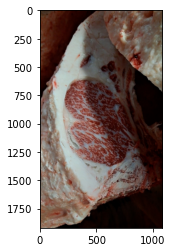
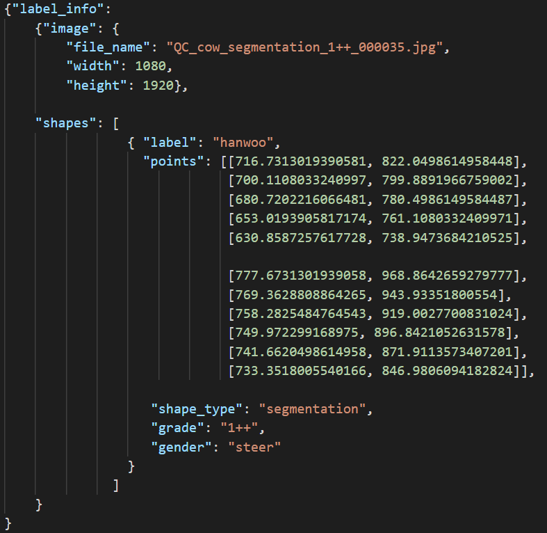
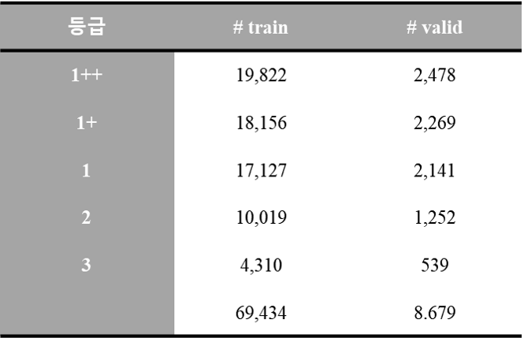
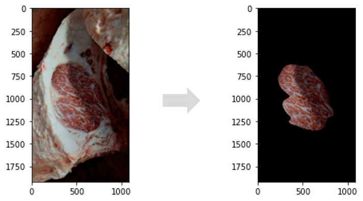
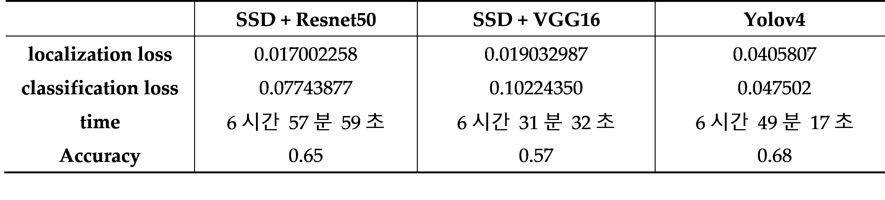
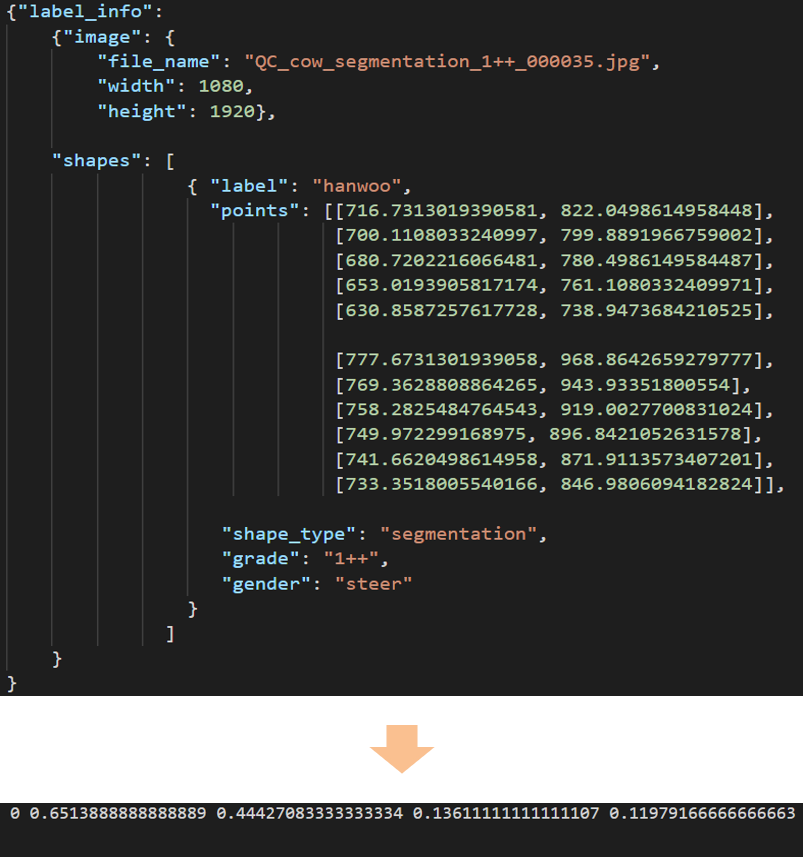

# igs 모델 제작 과정

## 1.데이터 선정
- [소고기 등심 품질 데이터](https://aihub.or.kr/aidata/30733)
        
    - 데이터 구성
        - 소고기 등심 부위의 도축 된 이미지 파일과 그에 대한 정보를 가지고 있는 json 파일로 구성

        

        
         
        
        

      

              
           
    
    - 69,434 개의 Train 데이터와 8,679개의 Validation 데이터로 구성
        - 각 등급 별 데이터의 수
            
            

      
        
         
    
    - 데이터 선정 이유
        - 각 등급 별 많은 수의 데이터 제공
        - 모든 이미지의 json 파일에서 이미지 정보 제공
        - 다각도 카메라 이미지 획득과 데이터 정제로 데이터의 정확도와 신뢰도를 높임
        - 축산물품질평가원의 품질평가 기준에 맞게 전문가 집단에서 데이터 분류 및 획득
        - 하루에 전국 각지에서 온 도체 50여개에 대해서 데이터를 꾸준히 획득

 
 

## 2.데이터 확인
- 데이터의 segmentation 정보 확인
    

    
     
    
- 이미지 분류 가능성 확인
    - 각 class 별 1000개의 train 데이터를 이용하여 간단한 CNN 모델을 만들어 학습
        - Loss가 줄고 있음을 확인
        - train 데이터의 정확도 0.98% 이상이 나옴을 확인
    - 각 class 별 200개의 test 데이터를 분류가 어느 정도 가능함을 확인
        - 47.24 %의 정확도

     

 
 

## 3. 알고리즘 선정
3. 알고리즘 선택 
    - 판정하고자 하는 사진의 배경에 영향을 받지 않기 위해 Object Detection 알고리즘 선택
      
    
     
    

     

    
    - 맞출 수 있는 hyper-parameter를 동일하게 설정한 후 학습 실행
    - 등급 별로 이미지가 많은 차이가 있지 않기 때문에 classification loss에 좀 더 비중을 두고 고려
    - 최종적으로 우리가 얻고자 하는 것은 이미지의 object detection 정확도 이기 때문에 Accuracy를 고려!

 
 

## 4. 데이터 전처리
- Json 파일의 잘못된 segmentation 좌표 수정
- 전체 데이터를 7:1:2의 비율로 train, validation, test 데이터로 나눔
    - train 데이터의 각 class 중 가장 개수가 적은 수 undersampling
        - 데이터의 불균형으로 학습이 한 class에 치우치는 것을 막기 위함
        
- Json파일을 텍스트 파일로 변환시켜주는 MakeLabel.py 파일 작성
    - segmentation 좌표를 이용하여 bounding box의 height와 width를 계산하여 정규화
    - segmentation 좌표를 이용하여 bounding box의 중심 (x, y) 좌표를 계산하여 정규화
    - 이미지의 클래스를 대응되는 숫자로 변환

     
        

 
 

## 5. 데이터 학습
- 설정파일 제작 및 수정
    - 데이터(train / validation / test) 경로 저장 파일 생성
            
            
    - detection 할 object class 정의 파일 생성
    - 데이터와 관련된 설정 파일 생성
        
    - 모델 관련 hyper-parameter 설정파일 수정
        - batch=32
        - subdivisions=32
        - max_batches = 10200
        - steps=8160, 9180
        - input height = 512, width = 512
                
            → 추후 hyper-parameter 최적화 필요

 

- 제작, 수정된 설정 파일 정보로 YOLOV4 로 학습
    - train data : 15,085 개 (4,310 * 0.7 * 5)
    - valid data : 2,155 개 (4,310 * 0.1 * 5)
    - test data : 4,310 개 (4,310 * 0.2 * 5)
        
    - 1000번의 학습마다 모델의 weights 저장
    - 가장 loss가 적게 나오는 모델의 weights 저장

 
 

## 6.이미지 판정 과정

 

 
 

## 7. 재학습
- 수집한 데이터의 전처리과정과 설정 파일 제작 과정을 반복
- 마지막으로 저장된 model의 weights를 이용하여 모델을 학습
- 학습한 데이터의 weights를 저장
    
- 재학습 시험
    - train data :  1,855 개 (530 * 0.7 * 5)
    - valid data : 265 개 (530 * 0.1 * 5)
    - test data : 530 개 (530 * 0.2 * 5)

